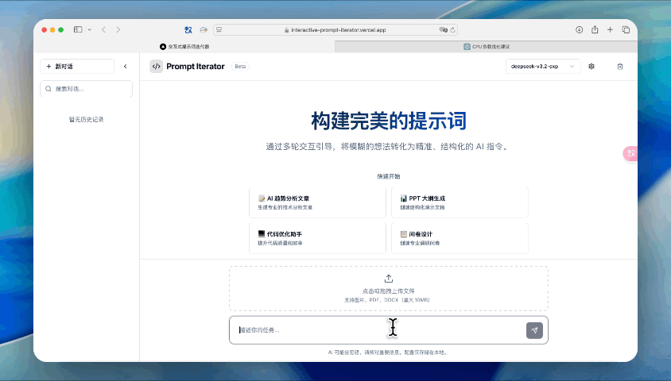
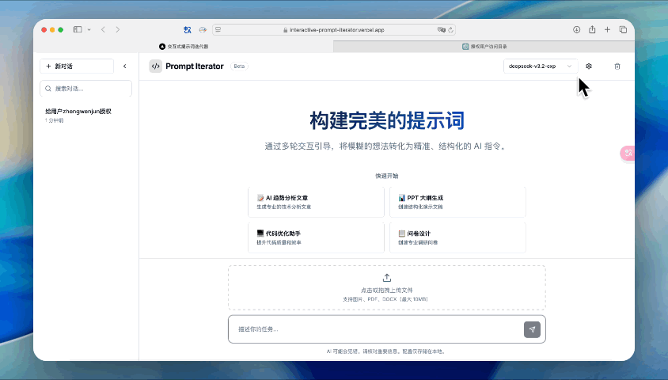
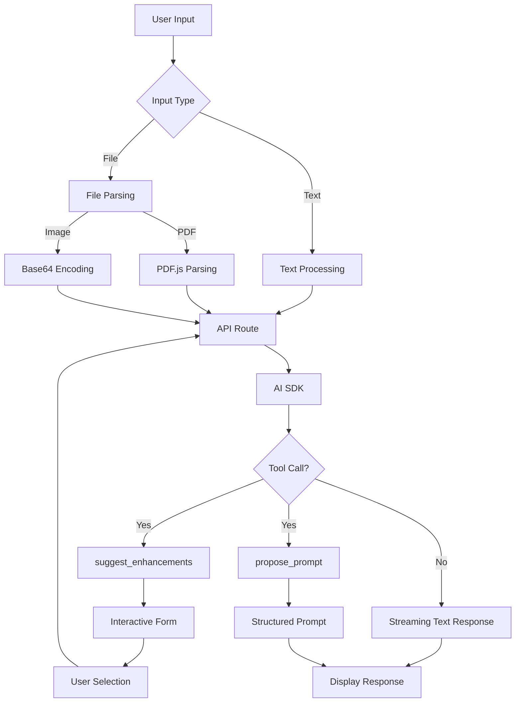
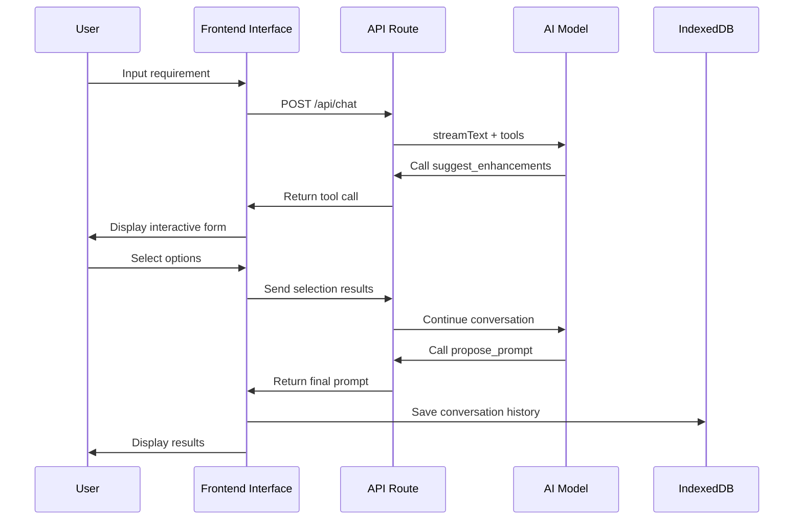

<div align="center">
  


  # 🚀 Interactive Prompt Iterator

  ### Interactive Prompt Iterator

  <p align="center">
    <strong>Transform vague ideas into structured, high-quality AI prompts through multi-turn interactive dialogue</strong>
  </p>

  <p align="center">
    <a href="https://github.com/systemoutprintlnhelloworld/interactive-prompt-iterator/stargazers">
      
    </a>
    <a href="https://github.com/systemoutprintlnhelloworld/interactive-prompt-iterator/network/members">
      
    </a>
    <a href="https://github.com/systemoutprintlnhelloworld/interactive-prompt-iterator/blob/master/LICENSE">
      
    </a>
    <a href="https://interactive-prompt-iterator.vercel.app">
      
    </a>
  </p>

  <p align="center">
    <a href="https://nextjs.org/">
      
    </a>
    <a href="https://www.typescriptlang.org/">
      
    </a>
    <a href="https://tailwindcss.com/">
      
    </a>
  </p>

  <p align="center">
    <a href="README_ZH.md">简体中文</a> •
    <a href="README.md">English</a> •
    <a href="#-feature-demos">Feature Demos</a> •
    <a href="#-quick-start">Quick Start</a> •
    <a href="TODO.md">Roadmap</a>
  </p>

  <p align="center">
    <a href="https://interactive-prompt-iterator.vercel.app" style="margin-right: 20px;">
      
    </a>
    <a href="https://vercel.com/new/clone?repository-url=https://github.com/systemoutprintlnhelloworld/interactive-prompt-iterator">
      
    </a>
  </p>

</div>

---

## 📑 Table of Contents

- [Feature Demos](#-feature-demos)
- [User Interaction Flow](#-user-interaction-flow)
- [Core Features](#-core-features)
- [Tech Stack](#️-tech-stack)
- [Quick Start](#-local-development)
- [Project Structure](#-project-structure)
- [Development Guide](#-development-guide)
- [FAQ](#-faq)
- [Contributing](#-contributing)
- [Changelog](#-changelog)

---

## 📺 Feature Demos

### Application Overview

<div align="center">
  
  <p><em>Interactive Prompt Iterator - Generate structured AI prompts through multi-dimensional option guidance</em></p>
</div>

### 1. Interactive Prompt Generation Flow
> **Scenario**: From vague requirements to precise prompts
>
> Demo: User inputs "Help me write an article about AI" → AI provides multi-dimensional options (role, style, depth, format) → User selects preferences → Generate structured prompt



#### Multi-turn Interactive Optimization
> Demo: Gradually refine requirements through multi-turn dialogue to generate high-quality prompts


### 2. File Upload and Parsing
> **Scenario**: Generate prompts based on document content
>
> Demo: Upload PDF papers/DOCX reports/image screenshots → Automatic content parsing → AI provides optimization suggestions based on file content → Generate targeted prompts


### 3. Multi-Scenario Application Examples

#### 📝 Scenario 1: Technical Blog Writing

<details>
<summary><kbd>User Input</kbd>: "Help me write a technical article about React Server Components"</summary>

**AI Response**: Immediately displays interactive form

| Dimension | Options |
|------|------|
| **Role Definition** | Senior Frontend Engineer / React Core Contributor / Tech Evangelist |
| **Target Audience** | Beginners / Intermediate Developers / Architects |
| **Content Depth** | Introduction Overview / Practical Tutorial / Architecture Deep Dive |
| **Output Format** | Markdown Blog / Presentation Script / Tutorial Series |

**Generated Prompt Example**:
```
You are a senior frontend engineer with 5 years of React development experience. Please write a technical article for intermediate developers that deeply explains the working principles, use cases, and best practices of React Server Components.

Requirements:
1. Include actual code examples and performance comparison data
2. Explain the differences between RSC and traditional SSR
3. Provide migration guide and common pitfalls
4. Output format: Markdown, including table of contents and code highlighting
5. Word count: 2000-3000 words
```
</details>

---

#### 💼 Scenario 2: Data Analysis Report

<details>
<summary><kbd>User Input</kbd>: "Analyze this sales data and generate a report" + Upload CSV file</summary>

**AI Response**: Displays interactive form after parsing file

| Dimension | Options |
|------|------|
| **Analysis Perspective** | Trend Analysis / Comparative Analysis / Predictive Analysis |
| **Report Audience** | Technical Team / Management / Clients |
| **Visualization Needs** | Chart Suggestions / Pivot Tables / Dashboard Design |
| **Output Format** | PPT Outline / Word Report / HTML Interactive Report |

**Generated Prompt Example**:
```
You are a data analysis expert. Based on the provided sales data CSV file, generate a quarterly sales analysis report for management.

Analysis Requirements:
1. Identify sales trends and anomalies
2. Compare performance across different product lines/regions
3. Provide actionable business recommendations
4. Include 3-5 key visualizations (line charts, bar charts, pie charts)
5. Output format: PPT outline, including page titles, key points, and chart descriptions
```
</details>

---

#### 🎓 Scenario 3: Academic Paper Polishing

<details>
<summary><kbd>User Input</kbd>: "Help me optimize this paper abstract" + Paste text</summary>

**AI Response**: Displays interactive form after analyzing text

| Dimension | Options |
|------|------|
| **Academic Field** | Computer Science / Biomedical / Social Sciences / Engineering |
| **Optimization Focus** | Academic Standards / Logical Clarity / Language Refinement / Innovation Highlight |
| **Target Journal** | Top Conference (e.g., NeurIPS) / SCI Q1 / Chinese Core |
| **Output Content** | Revision Suggestions / Direct Rewrite / Comparison Version |

**Generated Prompt Example**:
```
You are a senior academic editor in the field of computer science, specializing in machine learning paper polishing. Please optimize the following paper abstract to meet the submission standards of NeurIPS top conference.

Optimization Requirements:
1. Maintain original technical content and innovation points
2. Optimize academic expression using standard field terminology
3. Highlight research innovation and experimental results
4. Control word count to 150-200 words
5. Provide before/after comparison and revision rationale
```
</details>

---

#### 🎨 Scenario 4: UI Design Requirements Document

<details>
<summary><kbd>User Input</kbd>: "I need to design a shopping cart page for an e-commerce website"</summary>

**AI Response**: Immediately displays interactive form

| Dimension | Options |
|------|------|
| **Design Style** | Minimalist Modern / Business Professional / Vibrant Young / Luxury Premium |
| **Target Users** | Young People (18-30) / Family Users / Enterprise Procurement |
| **Core Features** | Quick Checkout / Coupon System / Batch Operations / Product Recommendations |
| **Output Format** | PRD Document / Figma Design Specs / Development Requirements |

**Generated Prompt Example**:
```
You are a UX designer with 8 years of experience, specializing in e-commerce. Please design a requirements document for a shopping cart page for a fashion e-commerce website targeting young users (18-30 years old).

Design Requirements:
1. Adopt minimalist modern design style
2. Core features: Quick checkout, coupon system, product recommendations
3. Mobile-first, responsive design
4. Output content:
   - Page layout and information architecture
   - Interaction flow diagram
   - Key component design specifications (buttons, forms, cards)
   - Accessibility and performance considerations
5. Format: Markdown PRD document, including Mermaid flow diagrams
```
</details>

> 💡 **Tip**: Each scenario demonstrates the complete transformation process from vague requirements to structured prompts, quickly clarifying user intent through interactive forms
### 4. Custom Template Management
> **Scenario**: Save and reuse common prompt templates
>
> Demo: Create custom prompt template → Save locally → Switch between different templates → Quickly apply to new conversations



---

## 🔄 User Interaction Flow

### Complete Usage Flow


### Core Interactive Features

- **🎯 Smart Guidance**: Gradually clarify requirements through multi-dimensional option forms
- **📁 Drag & Drop Upload**: Drag files anywhere on the page, full-screen upload area display
- **⭐ One-Click Favorite**: Click favorite button to toggle favorite status, yellow indicates favorited
- **🔍 Quick Search**: `Ctrl+K` opens Spotlight search, quickly find conversations and favorites
- **🎨 Smooth Animations**: Smooth animations for tab switching, favorite status, and file uploads

> 📖 **Detailed Flow Diagram**: See [User Interaction Flow Documentation](docs/user-interaction-flow.md) for complete interaction flow and sequence diagrams

---

## ✨ Core Features

- **🎯 Smart Interactive Guidance**: Gradually clarify user requirements through interactive forms and multi-turn dialogue
- **💾 Local-First**:
  - Configuration Storage: Use `Zustand` + `LocalStorage` to store API Key and model preferences
  - History: Use `Dexie.js` (IndexedDB) to store conversation history, supports offline access
- **🎨 Modern UI**:
  - Built with Tailwind CSS + Shadcn/UI design system
  - Supports dark mode
  - Responsive design, mobile-friendly
- **📁 File Support**:
  - Support image upload and paste (PNG, JPG, WebP)
  - Support PDF document parsing
  - Support multimodal models (GPT-4o, Claude 3.5, Gemini, etc.)
- **🔧 Flexible Configuration**:
  - Support multiple AI models (OpenAI, Claude, domestic large models)
  - Custom API Base URL
  - Adjustable system prompts
## 🛠️ Tech Stack

- **Framework**: Next.js 14.2.16 (App Router)
- **UI**: Tailwind CSS 3.4, Shadcn/UI, Lucide React
- **State Management**: Zustand 5.0
- **Database**: Dexie.js 4.2 (IndexedDB wrapper)
- **AI Integration**: Vercel AI SDK 6.0 (@ai-sdk/react, @ai-sdk/openai)
- **File Processing**: pdfjs-dist 5.4 (PDF parsing)

## 💻 Local Development

1. **Clone Repository**
```bash
git clone https://github.com/systemoutprintlnhelloworld/interactive-prompt-iterator.git
cd interactive-prompt-iterator
```

2. **Install Dependencies**
```bash
npm install
```

3. **Start Development Server**
```bash
npm run dev
```

4. **Access Application**
Open your browser and visit [http://localhost:3000](http://localhost:3000)

### ⚙️ Configuration Instructions

1. Click the **Settings Icon (⚙️)** in the top right corner
2. Enter your AI API configuration:
   - **API Key**: Your OpenAI/Claude/other compatible API key
   - **Base URL**: API endpoint address (default: `https://api.openai.com/v1`)
   - **Model**: Select the model to use
   - **System Prompt**: Custom system prompt (optional)

3. Click save to start using

> 💡 **Tip**: All configurations are stored locally in the browser and are not uploaded to the server

### 🔄 Update Guide

The application automatically detects version updates. When a new version is available, the version number next to the title will turn orange and display a download icon.

#### Update Steps

1. **Pull Latest Code**
```bash
git pull origin master
```

2. **Install New Dependencies** (if any)
```bash
npm install
```

3. **Restart Development Server**
```bash
npm run dev
```

> 💡 **Version Number Description**: Version number format is `v1.{commit count}`, automatically calculated based on GitHub commit count

### Supported Models

- **OpenAI**: gpt-4o, gpt-4o-mini, gpt-4-turbo, o1, o1-mini
- **Anthropic Claude**: claude-3-5-sonnet, claude-3-5-haiku, claude-3-opus
- **Domestic Large Models**: deepseek-chat, deepseek-reasoner, GLM-4-Plus, Qwen-Max, moonshot-v1-128k, etc.
## 📁 Project Structure

```
├── src/
│   ├── app/                 # Next.js App Router
│   │   ├── api/chat/       # AI chat API route
│   │   │   └── route.ts    # Streaming response + tool calls
│   │   ├── [locale]/       # Internationalization routing
│   │   │   └── page.tsx    # Main page
│   ├── components/          # React components
│   │   ├── ui/             # Shadcn UI base components
│   │   ├── chat-sidebar.tsx
│   │   ├── settings-dialog.tsx
│   │   └── ...
│   └── lib/                # Utility libraries
│       ├── store.ts        # Zustand state management
│       ├── db.ts           # Dexie.js database
│       └── utils.ts
├── public/                 # Static resources
└── package.json
```

---

## 🏗️ System Architecture

### Core Architecture Flow



> 💡 **Architecture Diagram Note**: It is recommended to use Mermaid or Excalidraw to generate a visual version of the above flow diagram
### Data Flow



> 💡 **Suggestion**: You can use [Excalidraw](https://excalidraw.com/) to draw more refined architecture diagrams, including:
> - Frontend component interaction diagram
> - State management flow diagram
> - AI tool call sequence diagram

---

## 🔧 Development Guide

### Build Production Version

```bash
npm run build
npm run start
```

### Code Linting

```bash
npm run lint
```

### Technical Highlights

- **Streaming Response**: Use Vercel AI SDK's `streamText` for real-time responses
- **Tool Calls**: Support AI proactively calling tools to generate interactive forms
- **State Persistence**: Zustand + localStorage for configuration persistence
- **Database**: Dexie.js wraps IndexedDB, supports complex queries
---

## ❓ FAQ

### 1. How to configure API Key?
Click the settings icon in the top right corner, enter your API Key and Base URL, then save.

### 2. Does it support domestic large models?
Yes, supports all OpenAI-compatible API interfaces, including DeepSeek, GLM, Qwen, etc.

### 3. Is data secure?
All data is stored locally in the browser (IndexedDB), and API Keys are not uploaded to the server.

### 4. How to export conversation history?
Currently supports manual copying. Batch export feature is under development.

### 5. Does it support mobile devices?
Yes, the interface is responsive and supports mobile browsers.

---

## 🤝 Contributing

Contributions are welcome! Please follow these steps:

1. Fork this repository
2. Create your feature branch (`git checkout -b feature/AmazingFeature`)
3. Commit your changes (`git commit -m 'Add some AmazingFeature'`)
4. Push to the branch (`git push origin feature/AmazingFeature`)
5. Open a Pull Request

---

## 📝 Changelog

See [CHANGELOG.md](CHANGELOG.md) for detailed version history.

---

## 📄 License

This project is licensed under the MIT License - see the [LICENSE](LICENSE) file for details.

---

## 🙏 Acknowledgments

- [Next.js](https://nextjs.org/) - React framework
- [Vercel AI SDK](https://sdk.vercel.ai/) - AI integration toolkit
- [Shadcn/UI](https://ui.shadcn.com/) - UI component library
- [Dexie.js](https://dexie.org/) - IndexedDB wrapper

---

<div align="center">
  <p>If this project helps you, please give it a ⭐️</p>
  <p>Made with ❤️ by the community</p>
</div>
