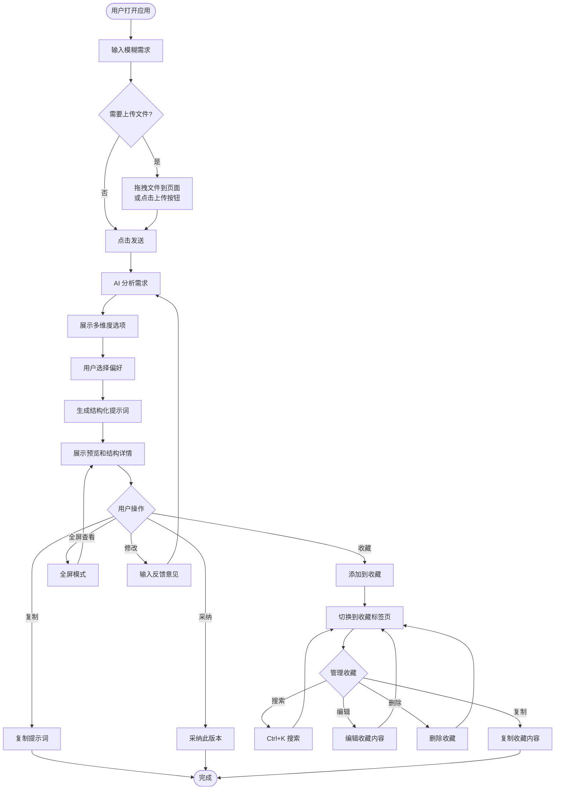
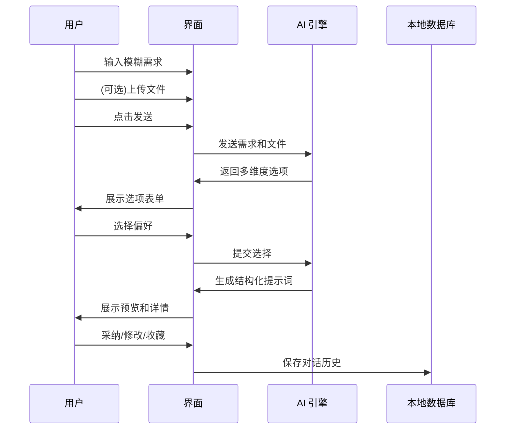
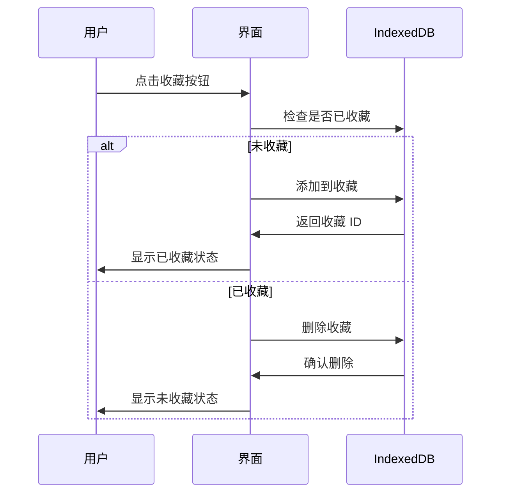
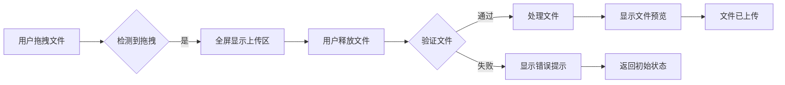

# 用户交互流程图

## 完整交互流程

## 核心功能流程

### 1. 提示词生成流程

### 2. 收藏管理流程

### 3. 文件上传流程

## 关键交互点

### 快捷键
- `Ctrl+K` / `Cmd+K`: 打开 Spotlight 搜索
- `Tab`: 在搜索中切换对话/收藏
- `↑↓`: 在搜索结果中导航
- `Enter`: 选择搜索结果

### 状态反馈
- 收藏按钮: 黄色表示已收藏,灰色表示未收藏
- 拖拽上传: 全屏动画提示上传区域
- 标签页切换: 滑动动画效果
- 加载状态: 脉冲动画和加载提示

### 数据持久化
- 对话历史: 自动保存到 IndexedDB
- 收藏提示词: 本地存储,支持搜索和管理
- 用户设置: API Key、Base URL、模型选择
